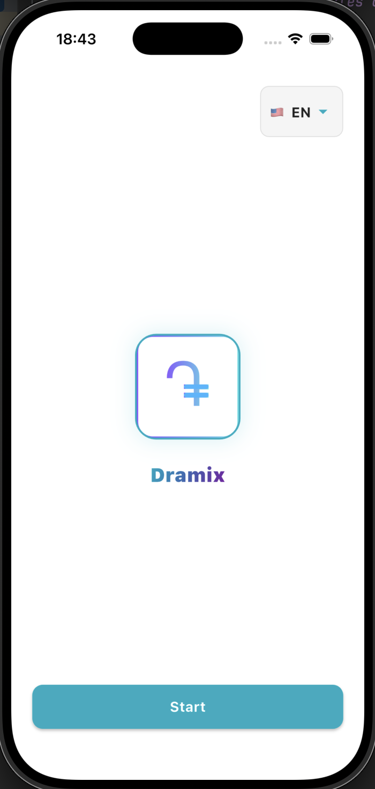
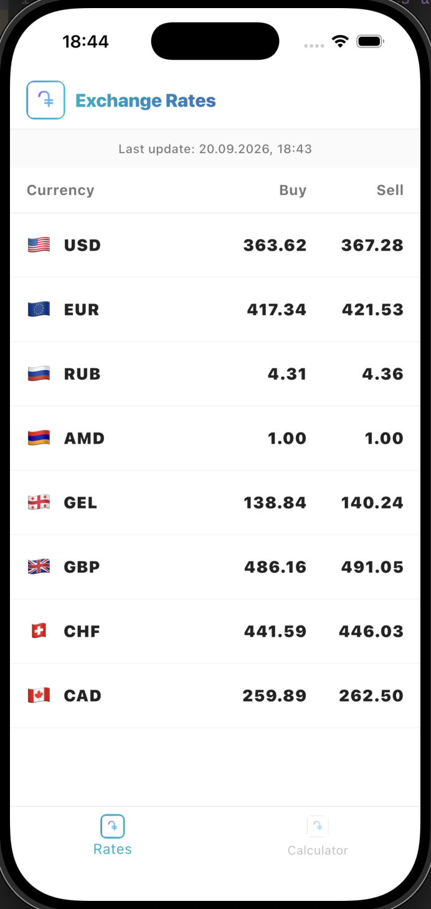
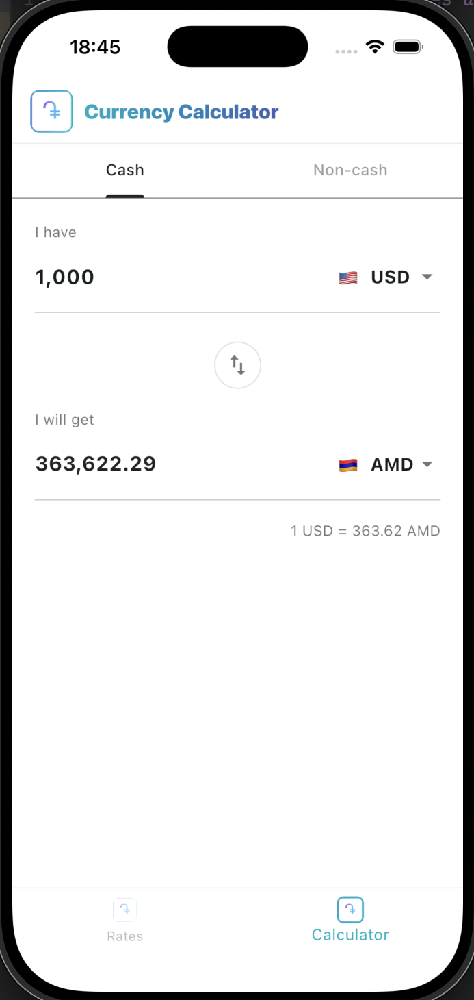

# Dramix - Currency Exchange Rates and Calculator

A professional cross-platform mobile application designed to provide real-time currency exchange rates and a built-in multi-functional calculator. Built with Flutter, following strict **Clean Architecture** principles and utilizing advanced state management and networking tools.

---

## 📱 App Screenshots

| Welcome Screen | Exchange Rates | Currency Calculator |
| :---: | :---: | :---: |
|  |  |  |

---

## 🛠️ Tech Stack & Features

* **Framework:** Flutter (Dart)
* **Architecture:** Clean Architecture (Data, Domain, Presentation layers)
* **State Management:** Flutter BLoC
* **Network & API:** Dio package for handling REST API requests
* **Dependency Injection:** GetIt (`injection.dart`)
* **Local Storage & Security:** Secure storage & local sources

---


## 📁 Project Structure

```text
lib/
├── config/
│   └── utils/
│       ├── colors.dart
│       ├── constants.dart
│       └── strings.dart
├── data/
│   ├── models/
│   │   └── currency_model.dart
│   ├── repositories/
│   │   └── currency_repository_impl.dart
│   ├── sources/
│   │   ├── local_sources/
│   │   │   ├── currency_local_source.dart
│   │   │   └── secure_storage.dart
│   │   └── remote_sources/
│   │       └── currency_remote_source.dart
│   └── exception.dart
├── domain/
│   ├── entities/
│   │   └── currency_entity.dart
│   └── repositories/
│       └── currency_repository.dart
├── presentation/
│   ├── bloc/
│   │   └── currency_bloc.dart
│   ├── screens/
│   │   ├── calculator_tab.dart
│   │   ├── cbrates_tab.dart
│   │   ├── main_screen.dart
│   │   └── welcome_screen.dart
│   └── widgets/
│       └── currency_widget.dart
├── injection.dart
└── main.dart

🏛️ Architecture Overview

Domain Layer: The core of the application, completely independent of external frameworks. It contains business logic, domain entities (currency_entity.dart), and abstract repository interfaces (currency_repository.dart).

Data Layer: Manages external data fetching from APIs (remote_sources/) and local persistence (local_sources/). It includes data models, exception handling, and concrete repository implementations.

Presentation Layer: Handles user interactions, UI presentation, and state flow. Built with custom widgets, modular screen tabs, and powered by BLoC for reliable state management.

Config / Utils: Centralized global application configurations, color codes, utility constants, and text strings.

## 🚀 Getting Started

1. **Clone the repository:**

git clone https://github.com/Martirosyan02/loan_calculator.git